# JOBSHEET PRAKTIKUM – UTS

## IDENTITAS PRAKTIKAN

| Komponen | Isi |
| :--- | :--- |
| Nama | Dwi Septa Satria Agung |
| Kelas / NIM | SIB-3D / 2341760033 |
| Tanggal | 23 / 10 / 2025 |
| Guru / Dosen | Ade Ismail, S.Kom., M.TI. |

## Instruksi Umum

1.  Mahasiswa wajib menggunakan proyek Flutter `ocr_sederhana` yang telah dibuat sebelumnya.
2.  Setiap penyelesaian tugas pada setiap Soal (Soal 1, Soal 2, dan Soal 3) harus diikuti dengan perintah Git commit dan push ke repositori GitHub masing-masing.
3.  Pesan Commit Wajib harus diikuti dengan tepat. Kelalaian dalam melakukan commit dan push akan mengurangi poin penilaian.

## Instruksi Awal (SETUP) - Wajib

1.  Pastikan proyek `ocr_sederhana` sudah diinisialisasi sebagai repositori Git dan terhubung ke akun GitHub Anda.
2.  Lakukan commit awal untuk memastikan branch `main` Anda bersih. 

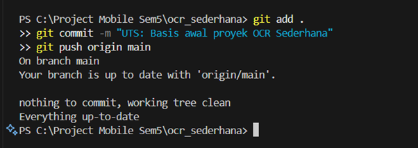

---

## Soal 1: Modifikasi Struktur Navigasi dan Aliran (30 Poin)

**Tujuan:** Menyederhanakan alur navigasi dan meningkatkan pengalaman pengguna di HomeScreen.

**1. Pengubahan Navigasi Home (15 Poin):**
* Ubah `ElevatedButton` di `HomeScreen` (`lib/screens/home_screen.dart`) menjadi *widget* **ListTile**.
* Atur `ListTile`: `leading: Icon(Icons.camera_alt, color: Colors.blue);`
* `title: Text('Mulai Pindai Teks Baru')`
* Fungsi `onTap` harus menggunakan `Navigator.push()` untuk ke `ScanScreen`. 

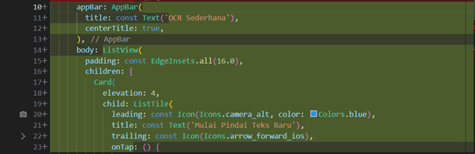

**2. Teks Utuh dan Navigasi Balik (15 Poin):**
* Di `ResultScreen` (`lib/screens/result_screen.dart`), hapus fungsi `ocrText.replaceAll` agar hasil teks ditampilkan dengan baris baru (`\n`) yang utuh. 

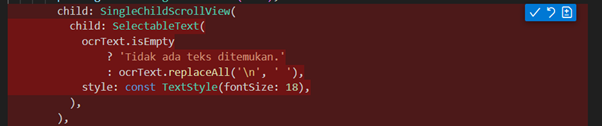

* Tambahkan `FloatingActionButton` dengan ikon `Icons.home`.
* Ketika tombol ditekan, navigasi harus kembali langsung ke `HomeScreen` menggunakan **`Navigator.pushAndRemoveUntil()`** (atau metode yang setara) untuk menghapus semua halaman di atasnya dari stack navigasi.

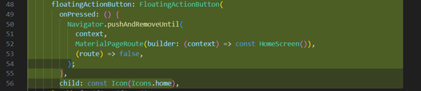

### Perintah Commit Wajib (Soal 1)

Setelah Soal 1 selesai, lakukan commit dan push dengan pesan:
`git add lib/screens/home_screen.dart lib/screens/result_screen.dart`
`git commit -m "UTS: Selesai Soal 1 - ListTile dan Navigasi Balik"`
`git push origin main` 

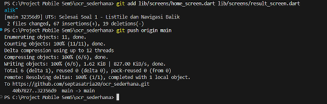

---

## Soal 2: Penyesuaian Tampilan dan Penanganan State/Error (40 Poin)

**Tujuan:** Memperbaiki tampilan *loading* dan memberikan *feedback* error yang lebih jelas.

**1. Custom Loading Screen di ScanScreen (20 Poin):**
* Di `ScanScreen` (`lib/screens/scan_screen.dart`), modifikasi tampilan *loading* yang muncul sebelum kamera siap (`if (!controller.value.isInitialized)`):
* Latar Belakang: `Scaffold(backgroundColor: Colors.grey[900])`.
* Isi: Di dalam `Center`, tampilkan `Column` berisi `CircularProgressIndicator(color: Colors.yellow)`.
* Di bawah indikator, tambahkan `Text('Memuat Kamera... Harap tunggu.', style: TextStyle(color: Colors.white, fontSize: 18))`.

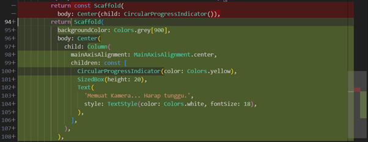

**2. Spesifikasi Pesan Error (20 Poin):**
* Di fungsi `_takePicture()` pada `ScanScreen`, modifikasi blok `catch (e)` untuk mengubah pesan *error* pada `SnackBar`.
* Pesan `SnackBar` harus berbunyi: `"Pemindaian Gagal! Periksa Izin Kamera atau coba lagi."` (Hilangkan variabel *error* (`$e`)). 

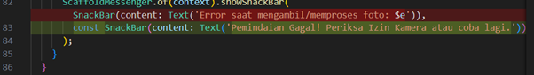

### Perintah Commit Wajib (Soal 2)

Setelah Soal 2 selesai, lakukan commit dan push dengan pesan:
`git add lib/screens/scan_screen.dart`
`git commit -m "UTS: Selesai Soal 2 - Tampilan Loading dan Error"`
`git push origin main` 

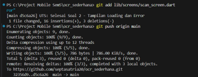

---

## Soal 3: Implementasi Plugin Text-to-Speech (TTS) (30 Poin)

**Tujuan:** Mengintegrasikan fitur membaca teks secara lisan menggunakan *plugin* `flutter_tts`.

**1. Instalasi Plugin (5 Poin):**
* Tambahkan *plugin* `flutter_tts` ke dalam file `pubspec.yaml` (gunakan versi terbaru yang kompatibel).

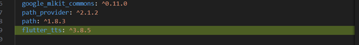

* Jalankan `flutter pub get`. 

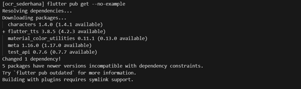

**2. Konversi Widget dan Inisialisasi (10 Poin):**
* Ubah `ResultScreen` dari `StatelessWidget` menjadi **`StatefulWidget`**. 

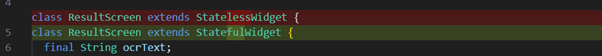

* Di `initState()`, inisialisasi `FlutterTts` dan atur bahasa pembacaan menjadi Bahasa Indonesia.

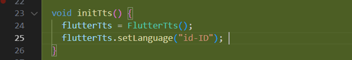

* Implementasikan `dispose()` untuk menghentikan mesin TTS saat halaman ditutup.

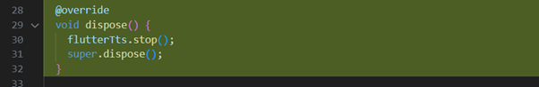

**3. Fungsionalitas Pembacaan (15 Poin):**
* Tambahkan `FloatingActionButton` kedua di `ResultScreen` (atau ganti `AppBar` dengan `action button`) dengan ikon `Icons.volume_up`.
* Ketika tombol ditekan, panggil fungsi `speak()` pada `FlutterTts` untuk membacakan seluruh isi `ocrText`. 

### Perintah Commit Wajib (Soal 3)

Setelah Soal 3 selesai, lakukan commit dan push terakhir dengan pesan:
`git add pubspec.yaml lib/screens/result_screen.dart`
`git commit -m "UTS: Selesai Soal 3 - Implementasi Flutter TTS"`
`git push origin main` 

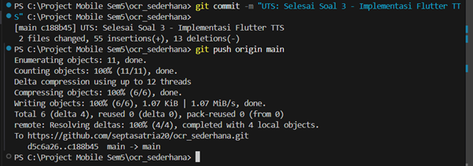

---

## Dokumentasi:

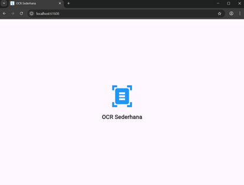

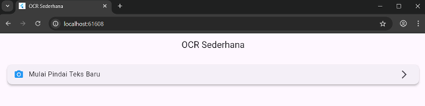

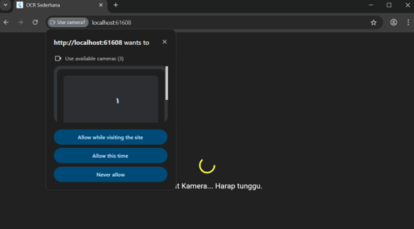