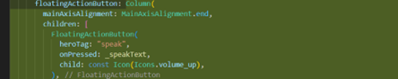

# JOBSHEET PRAKTIKUM – UTS

## IDENTITAS PRAKTIKAN

| Komponen | Isi |
| :--- | :--- |
| Nama | Dwi Septa Satria Agung |
| Kelas / NIM | SIB-3D / 2341760033 |
| Tanggal | 23 / 10 / 2025 |
| Guru / Dosen | Ade Ismail, S.Kom., M.TI. |

## Instruksi Umum

1.  [cite_start]Mahasiswa wajib menggunakan proyek Flutter `ocr_sederhana` yang telah dibuat sebelumnya. [cite: 320, 321]
2.  [cite_start]Setiap penyelesaian tugas pada setiap Soal (Soal 1, Soal 2, dan Soal 3) harus diikuti dengan perintah Git commit dan push ke repositori GitHub masing-masing. [cite: 322, 323]
3.  Pesan Commit Wajib harus diikuti dengan tepat. [cite_start]Kelalaian dalam melakukan commit dan push akan mengurangi poin penilaian. [cite: 324, 325]

## Instruksi Awal (SETUP) - Wajib

1.  [cite_start]Pastikan proyek `ocr_sederhana` sudah diinisialisasi sebagai repositori Git dan terhubung ke akun GitHub Anda. [cite: 327]
2.  [cite_start]Lakukan commit awal untuk memastikan branch `main` Anda bersih. 

---

## Soal 1: Modifikasi Struktur Navigasi dan Aliran (30 Poin)

[cite_start]**Tujuan:** Menyederhanakan alur navigasi dan meningkatkan pengalaman pengguna di HomeScreen. [cite: 331, 332]

**1. [cite_start]Pengubahan Navigasi Home (15 Poin):** [cite: 333]
* Ubah `ElevatedButton` di `HomeScreen` (`lib/screens/home_screen.dart`) menjadi *widget* **ListTile**. [cite: 334]
* [cite_start]Atur `ListTile`: `leading: Icon(Icons.camera_alt, color: Colors.blue);` [cite: 335]
* `title: Text(’Mulai Pindai Teks Baru’)` [cite: 336]
* [cite_start]Fungsi `onTap` harus menggunakan `Navigator.push()` untuk ke `ScanScreen`. 

**2. [cite_start]Teks Utuh dan Navigasi Balik (15 Poin):** [cite: 338]
* Di `ResultScreen` (`lib/screens/result_screen.dart`), hapus fungsi `ocrText.replaceAll` agar hasil teks ditampilkan dengan baris baru (`\n`) yang utuh. 

* [cite_start]Tambahkan `FloatingActionButton` dengan ikon `Icons.home`. [cite: 340]
* [cite_start]Ketika tombol ditekan, navigasi harus kembali langsung ke `HomeScreen` menggunakan **`Navigator.pushAndRemoveUntil()`** (atau metode yang setara) untuk menghapus semua halaman di atasnya dari stack navigasi. [cite: 341, 342]

### Perintah Commit Wajib (Soal 1)

[cite_start]Setelah Soal 1 selesai, lakukan commit dan push dengan pesan: [cite: 344]
[cite_start]`git add lib/screens/home_screen.dart lib/screens/result_screen.dart` [cite: 345]
[cite_start]`git commit -m "UTS: Selesai Soal 1 - ListTile dan Navigasi Balik"` [cite: 346]
[cite_start]`git push origin main` 

---

## Soal 2: Penyesuaian Tampilan dan Penanganan State/Error (40 Poin)

[cite_start]**Tujuan:** Memperbaiki tampilan *loading* dan memberikan *feedback* error yang lebih jelas. [cite: 350, 351]

**1. [cite_start]Custom Loading Screen di ScanScreen (20 Poin):** [cite: 352]
* Di `ScanScreen` (`lib/screens/scan_screen.dart`), modifikasi tampilan *loading* yang muncul sebelum kamera siap (`if (!controller.value.isInitialized)`): [cite: 353]
* [cite_start]Latar Belakang: `Scaffold(backgroundColor: Colors.grey[900])`. [cite: 354]
* [cite_start]Isi: Di dalam `Center`, tampilkan `Column` berisi `CircularProgressIndicator(color: Colors.yellow)`. [cite: 355]
* Di bawah indikator, tambahkan `Text(’Memuat Kamera... Harap tunggu.’, style: TextStyle(color: Colors.white, fontSize: 18))`. [cite: 356, 357]

**2. [cite_start]Spesifikasi Pesan Error (20 Poin):** [cite: 358]
* Di fungsi `_takePicture()` pada `ScanScreen`, modifikasi blok `catch (e)` untuk mengubah pesan *error* pada `SnackBar`. [cite: 359]
* [cite_start]Pesan `SnackBar` harus berbunyi: `"Pemindaian Gagal! Periksa Izin Kamera atau coba lagi."` (Hilangkan variabel *error* (`$e`)). 

### Perintah Commit Wajib (Soal 2)

[cite_start]Setelah Soal 2 selesai, lakukan commit dan push dengan pesan: [cite: 362]
[cite_start]`git add lib/screens/scan_screen.dart` [cite: 363]
[cite_start]`git commit -m "UTS: Selesai Soal 2 - Tampilan Loading dan Error"` [cite: 364]
[cite_start]`git push origin main` 

---

## Soal 3: Implementasi Plugin Text-to-Speech (TTS) (30 Poin)

[cite_start]**Tujuan:** Mengintegrasikan fitur membaca teks secara lisan menggunakan *plugin* `flutter_tts`. [cite: 367, 368]

**1. [cite_start]Instalasi Plugin (5 Poin):** [cite: 369]
* [cite_start]Tambahkan *plugin* `flutter_tts` ke dalam file `pubspec.yaml` (gunakan versi terbaru yang kompatibel). [cite: 370, 371]

* Jalankan `flutter pub get`. 

**2. [cite_start]Konversi Widget dan Inisialisasi (10 Poin):** [cite: 373]
* Ubah `ResultScreen` dari `StatelessWidget` menjadi **`StatefulWidget`**. 

* [cite_start]Di `initState()`, inisialisasi `FlutterTts` dan atur bahasa pembacaan menjadi Bahasa Indonesia. [cite: 375, 376]

* [cite_start]Implementasikan `dispose()` untuk menghentikan mesin TTS saat halaman ditutup. [cite: 377, 378]

**3. [cite_start]Fungsionalitas Pembacaan (15 Poin):** [cite: 379]
* [cite_start]Tambahkan `FloatingActionButton` kedua di `ResultScreen` (atau ganti `AppBar` dengan `action button`) dengan ikon `Icons.volume_up`. [cite: 380, 381]
* Ketika tombol ditekan, panggil fungsi `speak()` pada `FlutterTts` untuk membacakan seluruh isi `ocrText`. 

### Perintah Commit Wajib (Soal 3)

Setelah Soal 3 selesai, lakukan commit dan push terakhir dengan pesan: [cite: 384]
`git add pubspec.yaml lib/screens/result_screen.dart` [cite: 385]
`git commit -m "UTS: Selesai Soal 3 - Implementasi Flutter TTS"` [cite: 386]
`git push origin main` 

---

## Dokumentasi:

